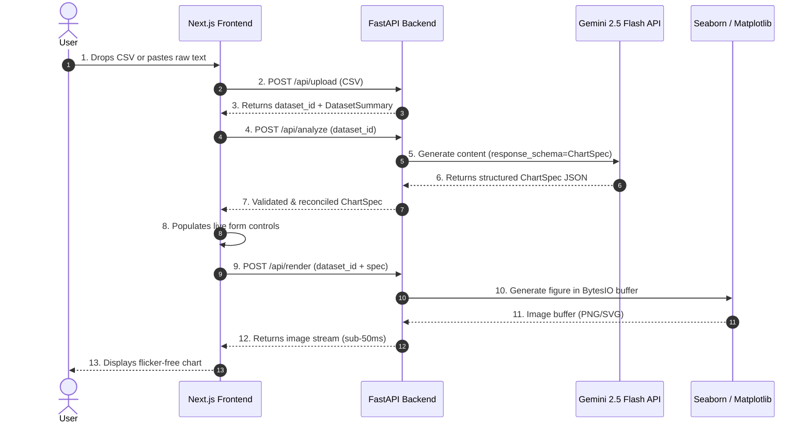

# AiCharter — AI Dataset Visualizer & Live Spec Engine

> **AI-Driven Data Visualization Engine**: Instantly transform raw tabular datasets (CSVs or text previews) into publication-grade statistical charts using **Google Gemini 2.5 Flash** structured outputs, **FastAPI**, **Pandas**, **Seaborn**, **Next.js**, and **Tailwind CSS**.

---

## 🚀 Key Features

- **Structured AI Recommendations**: Gemini 2.5 Flash scans dataset profiles (column types, cardinalities, sample rows) and outputs a type-safe Pydantic `ChartSpec` JSON object—**never executing raw AI-generated Python code**.
- **Real-Time Interactive Spec Tweaking**: Form controls populate instantly with AI recommendations. Tweak titles, color palettes, Seaborn themes, aggregations, and axis columns in real time with sub-100ms debounced re-renders without re-calling the LLM API.
- **Session-Based Optimization**: Uploads datasets once (`POST /api/upload`) to receive a `dataset_id`. Subsequent renders send only `dataset_id` + `ChartSpec`, cutting network overhead by ~99%.
- **Flicker-Free Double-Buffered UI**: React pre-loader double-buffering swaps image buffers on `onLoad` to eliminate flickering.
- **Export Capabilities**: Download charts in high-resolution PNG (150 DPI), vector SVG, or export the raw reproducible JSON Spec.
- **Sample Dataset Presets**: 1-click preset datasets (*Quarterly Tech Sales*, *Iris Flower Metrics*, *Global Temperatures*, *AI Salaries*) for immediate evaluation.

---

## 🏗 Architecture & Data Flow



---

## 🛠 Tech Stack

- **Backend**: Python 3.12, FastAPI, Pandas, Matplotlib, Seaborn, Pydantic v2, `google-genai` SDK, Pytest
- **Frontend**: Next.js 15 (React 19), Tailwind CSS, TypeScript, Lucide Icons
- **AI Integration**: Gemini 2.5 Flash via Google AI Studio API (`response_schema`)
- **DevOps**: Docker, Docker Compose, GitHub Actions CI/CD

---

## 📦 Quickstart & Local Setup

### Prerequisites
- Python 3.12+
- Node.js 22+
- Gemini API Key ([Google AI Studio](https://aistudio.google.com/))

### 1. Clone & Configure Environment
```bash
git clone git@github.com:joehu131/AiCharter.git
cd AiCharter

# Copy backend environment template
cp backend/.env.example backend/.env
```
Edit `backend/.env` and add your Gemini API key:
```env
GEMINI_API_KEY=your_actual_gemini_api_key
GEMINI_MODEL=gemini-2.5-flash
```

### 2. Run Backend (FastAPI)
```bash
cd backend
python -m venv .venv

# On Windows PowerShell:
.venv\Scripts\Activate.ps1
# On Linux/macOS:
source .venv/bin/activate

pip install -r requirements.txt
pytest tests -v
uvicorn app.main:app --reload --port 8000
```
Backend API will be available at `http://localhost:8000` (Swagger UI at `http://localhost:8000/docs`).

### 3. Run Frontend (Next.js)
```bash
cd frontend
npm install
npm run dev
```
Open `http://localhost:3000` in your browser.

---

## 🐳 Docker Deployment

To spin up both backend and frontend in isolated containers:
```bash
docker-compose up --build
```

---

## 📄 License
MIT License
