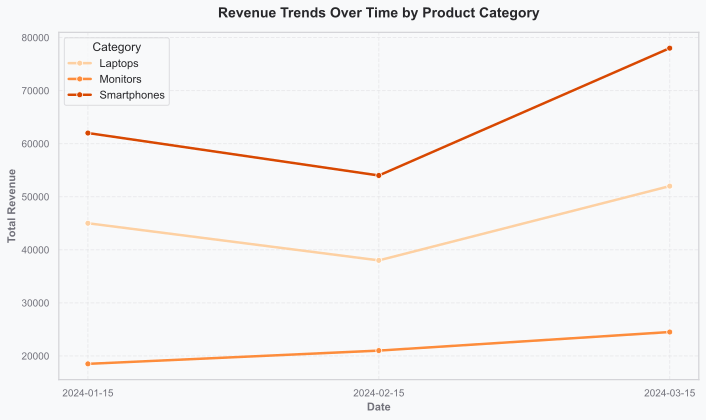
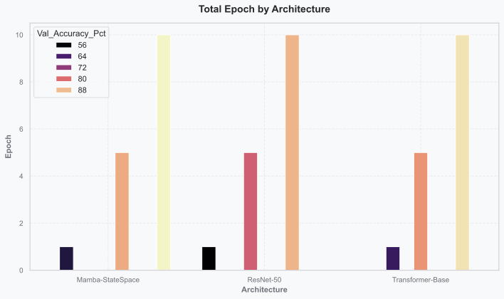
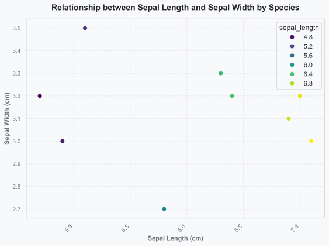
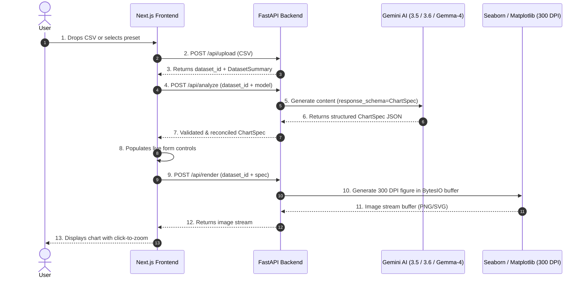
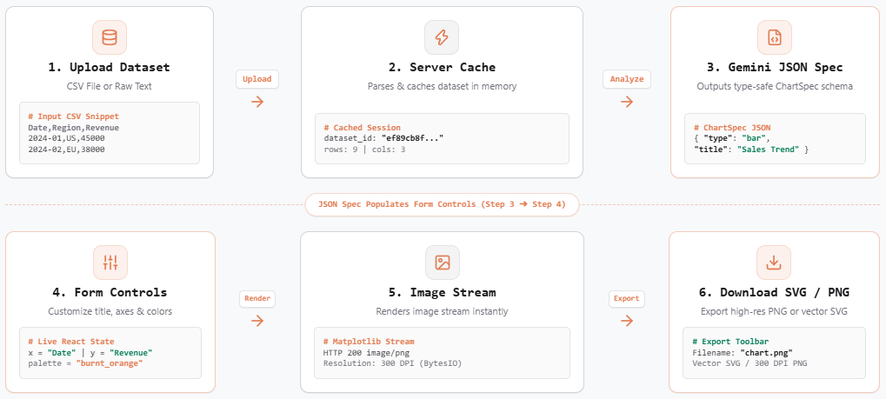

# QuickPlot Studio (WIP)

A dataset visualizer that turns table data such as CSV files into good looking charts using AI-driven chart specification and server-side rendering with Seaborn/Matplotlib. The purpose of this project is to enable prettier charts faster

--> Upload a CSV (or pick a preset), let Gemini suggest a chart spec, tweak it in real time, and export the result as a high-res PNG, SVG, or raw JSON spec.

<table>
  <tr>
    <td width="50%" align="center">
      
    </td>
    <td width="50%" align="center">
      
    </td>
  </tr>
  <tr>
    <td width="50%" align="center">
      
    </td>
    <td width="50%" align="center">
      
    </td>
  </tr>
</table>

---

## Features

- **Multi-model support** — Switch between the Free Gemini models: 3.5 Flash Lite, Gemini 3.6 Flash, Gemma-4-26b, or a rule-based fallback (no AI).
- **Structured AI output** — Gemini returns a typed `ChartSpec` JSON validated by Pydantic. No AI-generated code is executed.
- **Live spec editing** — Form fields are populated with the AI recommendation but you can adjust titles, themes, grid/background styles, aggregations, and axes without re-calling the LLM.
- **Matplotlib rendering** — Charts render server-side with Matplotlib.
- **Export** — Download as 300 DPI PNG, vector SVG, or the raw JSON chart spec.
- **8 built-in dataset presets** — SaaS Churn & LTV, Tech Stock Volatility, Customer Segmentation, ML Model Benchmarks, Quarterly Tech Sales, Iris Flower Metrics, Global Temperatures, AI Salaries.
---

## Architecture



### Pipeline Stages



---

## Tech Stack

| Layer | Tools |
|-------|-------|
| Backend | `Python 3.12`, `FastAPI`, `Pandas`, `Matplotlib`, `Seaborn`, `Pydantic v2`, `google-genai SDK`, `Pytest` |
| Frontend | `Next.js 15 (React 19)`, `Tailwind CSS`, `TypeScript`, `Lucide Icons` |
| AI | `Gemini 3.5 Flash Lite`, `Gemini 3.6 Flash`, `Gemma-4-26b`, `Rule-based engine` |
| Infra | `Docker`, `Docker Compose`, `GitHub Actions CI/CD` |

---

## Configuration

Application settings in `backend/app/config.py`

- **`backend/.env`** — Secrets:
  ```env
  GEMINI_API_KEY=your_gemini_api_key
  ```
- **`backend/app/config.py`** — Defaults:
  ```python
  GEMINI_MODEL: str = "gemini-3.5-flash-lite"
  PROJECT_NAME: str = "QuickPlot Studio API"
  API_PREFIX: str = "/api"
  MAX_UPLOAD_SIZE_MB: int = 5
  ```

---

## Quickstart

### Prerequisites

- Python 3.12+
- Node.js 22+
- Gemini API key ([Google AI Studio](https://aistudio.google.com/))

### 1. Clone and configure

```bash
git clone git@github.com:joehu131/QuickPlotStudio.git
cd QuickPlotStudio

echo "GEMINI_API_KEY=your_actual_gemini_api_key" > backend/.env
```

### 2. Backend (FastAPI)

```bash
cd backend
python -m venv .venv

# Windows PowerShell:
.venv\Scripts\Activate.ps1
# Linux / macOS:
source .venv/bin/activate

pip install -r requirements.txt
pytest tests -v
uvicorn app.main:app --reload --port 8000
```

API at `http://localhost:8000` — Swagger UI at `http://localhost:8000/docs`.

### 3. Frontend (Next.js)

```bash
cd frontend
npm install
npm run dev
```

Open `http://localhost:3000`.

---

## License

MIT — Joel Hultman 2026
