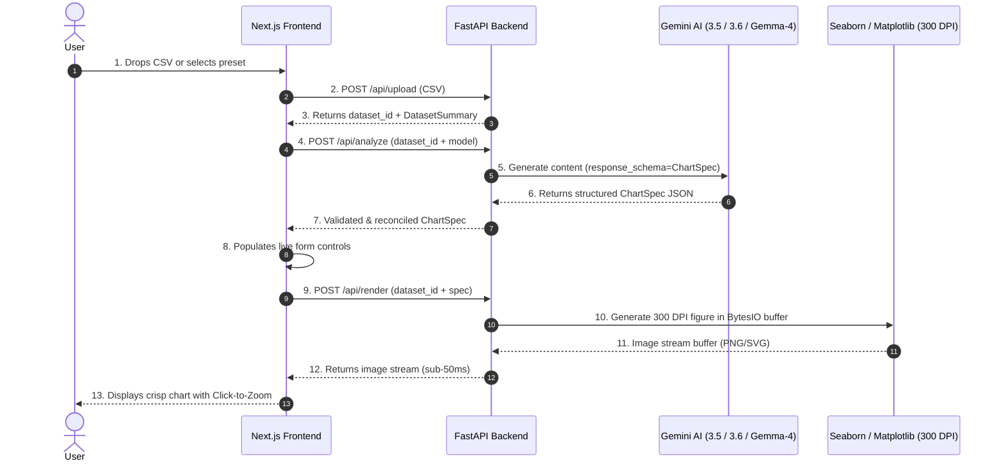

# AiCharter — AI Dataset Visualizer & Multi-Model Engine

> **High-Key Executive Analytics Engine**: Instantly transform raw tabular datasets (CSVs or text previews) into publication-grade 300 DPI statistical charts using **Google Gemini 3.5 Flash Lite**, **FastAPI**, **Pandas**, **Seaborn**, **Next.js 15**, and **Tailwind CSS**.

---

## 🚀 Key Features

- **High-Key Executive Consulting Aesthetic**: Clean white background (`#FFFFFF`), light warm grey panel cards (`#F8F9FA`), and crisp Burnt Orange (`#E27C52`) accents—designed for executive reports and portfolio presentation.
- **Multi-Model Engine Selector Dropdown**: Switch dynamically between `Gemini 3.5 Flash Lite` (Recommended), `Gemini 3.6 Flash` (Heavy Duty), `gemma-4-26b-a4b-it` (AI Fallback), and `Rule-Based Engine (No AI)`.
- **Automatic Gemma-4 Rate-Limit Fallback**: Intercepts 429 rate-limit quota errors from Gemini and automatically retries with `gemma-4-26b-a4b-it` before falling back to deterministic statistical rules.
- **Structured AI Specifications**: Gemini scans dataset profiles (column types, cardinalities, sample rows) and outputs a type-safe Pydantic `ChartSpec` JSON object—**never executing raw AI-generated Python code**.
- **Real-Time Interactive Spec Tweaking**: Form controls populate instantly with AI recommendations. Tweak titles, color palettes, Seaborn style themes, aggregations, and axis columns with sub-50ms debounced re-renders without re-calling LLM APIs.
- **Publication-Grade 300 DPI Stream**: Renders Matplotlib figure buffers at 300 DPI pixel density on matching light canvas backgrounds with click-to-zoom fullscreen view.
- **Session-Based Optimization**: Uploads datasets once (`POST /api/upload`) to receive a `dataset_id`. Subsequent renders pass only `dataset_id` + `ChartSpec`, cutting network overhead by ~99%.
- **Export Capabilities**: Download charts in 300 DPI PNG, vector SVG, or export the raw reproducible JSON Spec.
- **8 Advanced Dataset Presets**: 1-click presets (*SaaS Churn & LTV*, *Tech Stock Volatility*, *Customer Segmentation*, *ML Model Benchmarks*, *Quarterly Tech Sales*, *Iris Flower Metrics*, *Global Temperatures*, *AI Salaries*).
- **Interactive System Architecture Docs**: Built-in 6-stage architecture flowchart modal (`DocsModal.tsx`) and comprehensive pipeline guide ([`docs/DATA_PIPELINE_WALKTHROUGH.md`](docs/DATA_PIPELINE_WALKTHROUGH.md)).

---

## 🏗 Architecture & 6-Stage Pipeline Flow



---

## ⚙️ Configuration & Single Source of Truth

Application settings are managed in `backend/app/config.py` as the single authoritative source of truth.

- **`backend/.env`**: Contains **only** secret environment keys:
  ```env
  GEMINI_API_KEY=your_actual_gemini_api_key
  ```
- **`backend/app/config.py`**: Defines default application settings:
  ```python
  GEMINI_MODEL: str = "gemini-3.5-flash-lite"  # Single source of truth for default model
  PROJECT_NAME: str = "AiCharter API"
  API_PREFIX: str = "/api"
  MAX_UPLOAD_SIZE_MB: int = 5
  ```

---

## 🛠 Tech Stack

- **Backend**: Python 3.12, FastAPI, Pandas, Matplotlib, Seaborn, Pydantic v2, `google-genai` SDK, Pytest
- **Frontend**: Next.js 15 (React 19), Tailwind CSS, TypeScript, Lucide Icons
- **AI Engine Options**: Gemini 3.5 Flash Lite, Gemini 3.6 Flash, Gemma-4-26b, Rule-Based Statistical Engine
- **DevOps**: Docker, Docker Compose, GitHub Actions CI/CD

---

## 📦 Quickstart & Local Setup

### Prerequisites
- Python 3.12+
- Node.js 22+
- Gemini API Key ([Google AI Studio](https://aistudio.google.com/))

### 1. Clone & Configure Secret API Key
```bash
git clone git@github.com:joehu131/AiCharter.git
cd AiCharter

# Create backend/.env with your Gemini API key
echo "GEMINI_API_KEY=your_actual_gemini_api_key" > backend/.env
```

### 2. Run Backend (FastAPI)
```bash
cd backend
python -m venv .venv

# On Windows PowerShell:
.venv\Scripts\Activate.ps1
# On Linux/macOS:
source .venv/bin/activate

pip install -r requirements.txt
pytest tests -v
uvicorn app.main:app --reload --port 8000
```
Backend API will be available at `http://localhost:8000` (Swagger UI at `http://localhost:8000/docs`).

### 3. Run Frontend (Next.js)
```bash
cd frontend
npm install
npm run dev
```
Open `http://localhost:3000` in your browser.

---

## 🐳 Docker Deployment

To spin up both backend and frontend in isolated containers:
```bash
docker-compose up --build
```

---

## 📄 License
MIT License — Built by **Joel Hultman 2026**
