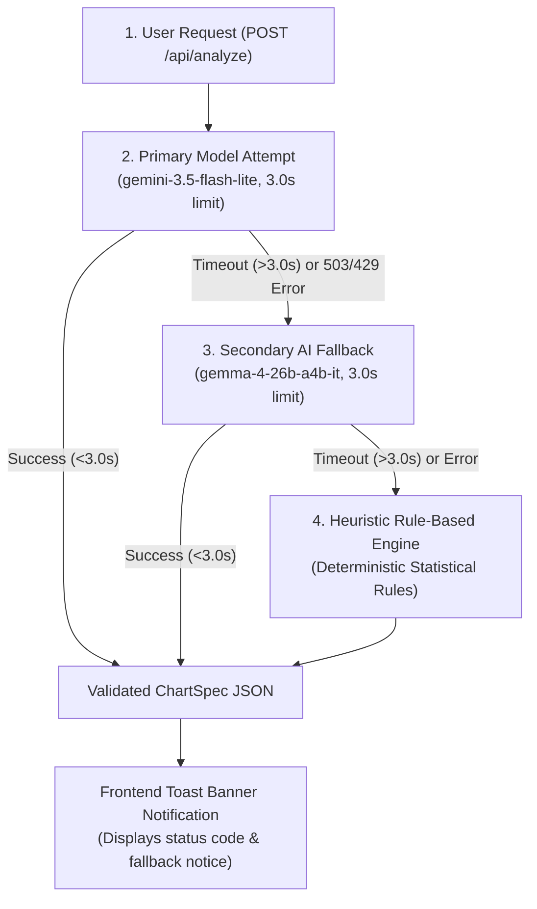

# QuickPlot Studio — Data Pipeline & Transformation Walkthrough

This document provides a step-by-step educational walkthrough of how a dataset travels through **QuickPlot Studio**—from raw CSV text input all the way to a live rendered 300 DPI chart image stream.

We use the **Quarterly Tech Sales** dataset as our baseline reference implementation.

---

## Step 1: Raw Data Input (`DataInput.tsx`)

When a user selects a preset or uploads a CSV file, the frontend dispatches the raw CSV string to `POST /api/upload/text` (or `POST /api/upload` for binary files):

```csv
Date,Category,Region,Revenue,Units_Sold
2024-01-15,Laptops,North America,45000.00,30
2024-01-15,Smartphones,North America,62000.50,85
2024-01-15,Monitors,North America,18500.00,45
2024-02-15,Laptops,Europe,38000.00,25
2024-02-15,Smartphones,Europe,54000.00,70
2024-02-15,Monitors,Europe,21000.00,50
2024-03-15,Laptops,Asia,52000.00,38
2024-03-15,Smartphones,Asia,78000.00,110
2024-03-15,Monitors,Asia,24500.00,58
```

---

## Step 2: Server Storage & Profiling (`data_service.py`)

The FastAPI backend receives the CSV text and executes two core tasks:
1. **In-Memory Session Caching**: Loads the CSV into a Pandas `DataFrame` stored in an in-memory cache mapped to a unique UUID session ID (`dataset_id`).
2. **Column Profiling**: Auto-detects data types (`datetime`, `numeric`, `categorical/text`) and constructs a lightweight summary object (`DatasetSummary`):

```json
{
  "dataset_id": "a9f1b2c3-4d5e-6f7a-8b9c-0d1e2f3a4b5c",
  "row_count": 9,
  "column_count": 5,
  "columns": ["Date", "Category", "Region", "Revenue", "Units_Sold"],
  "column_types": {
    "Date": "datetime",
    "Category": "categorical/text",
    "Region": "categorical/text",
    "Revenue": "numeric",
    "Units_Sold": "numeric"
  }
}
```

---

## Step 3: AI Inference & Pydantic Schema Validation (`ai_service.py`)

FastAPI sends the dataset profile and a 5-row sample preview to Gemini via `POST /api/analyze`. 

Instead of asking AI for unverified Python code, FastAPI passes the `ChartSpec` Pydantic model into Gemini’s `response_schema` parameter. Gemini returns a **type-safe JSON object**:

```json
{
  "chart_type": "bar",
  "title": "Total Revenue by Category Across Regions",
  "x_column": "Category",
  "y_column": "Revenue",
  "hue_column": "Region",
  "aggregation": "sum",
  "x_label": "Product Category",
  "y_label": "Total Revenue ($)",
  "theme": "burnt_orange",
  "grid_style": "whitegrid",
  "fig_width": 10.0,
  "fig_height": 6.0,
  "show_grid": true,
  "reasoning": "A grouped bar chart effectively compares total revenue across tech product categories while categorizing by geographic sales region."
}
```

> **Safety & Guard**: `data_service.reconcile_chart_spec()` verifies that all column names inside the JSON (`Category`, `Revenue`, `Region`) actually exist in the Pandas DataFrame.

### AI Timeout & Fallback Pipeline (`AI_API_TIMEOUT_SECONDS = 3.0`)

To guarantee fast response times, every AI API call is wrapped in a thread-isolated timeout (`AI_API_TIMEOUT_SECONDS = 3.0` in `config.py`). If the primary model times out or returns an HTTP error (such as 503 UNAVAILABLE or 429 RATE LIMIT), the backend executes an automatic fallback sequence:



---

## Step 4: Real-Time Form Controls Sync (`ChartControls.tsx`)

The React frontend receives the recommended `ChartSpec` and populates the form controls:
- **Chart Type**: `Bar Chart`
- **X-Axis**: `Category`
- **Y-Axis**: `Revenue`
- **Group (Hue)**: `Region`
- **Aggregation**: `Sum`
- **Theme**: `Burnt Orange`

Whenever a user tweaks any dropdown (e.g., changing theme from `Light Grid` to `Dark Grid` or adjusting dimensions), React sends only the lightweight JSON spec to `POST /api/render`. **No AI model is called during form edits**, keeping responses under 50ms!

---

## Step 5: High-DPI Seaborn/Matplotlib Rendering (`plot_service.py`)

FastAPI passes the cached `DataFrame` and the updated `ChartSpec` to the rendering engine:

1. **Aggregation**:
   ```python
   # Pandas groups and sums revenue:
   plot_df = df.groupby(["Category", "Region"], as_index=False)["Revenue"].sum()
   ```

2. **Seaborn Styling & Plot Generation**:
   ```python
   # Configures theme, canvas background (#F8F9FA), and gridlines:
   sns.set_theme(style="whitegrid", rc={"axes.facecolor": "#F8F9FA", ...})
   
   # Draws grouped bar plot:
   sns.barplot(data=plot_df, x="Category", y="Revenue", hue="Region", palette=...)
   ```

3. **High-DPI 300 DPI Stream Output**:
   ```python
   # Saves binary PNG buffer at 300 DPI resolution without writing files to disk:
   buf = io.BytesIO()
   fig.savefig(buf, format="png", dpi=300, bbox_inches="tight")
   return buf.getvalue()
   ```

4. The browser receives the binary image stream and renders the sharp visualization directly inside the `` tag!
